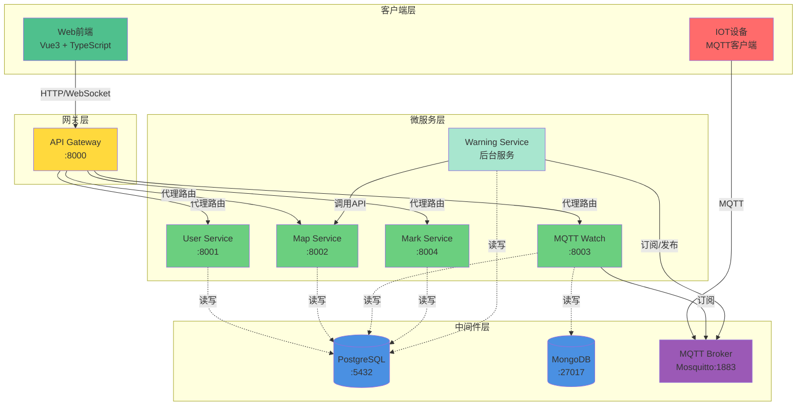
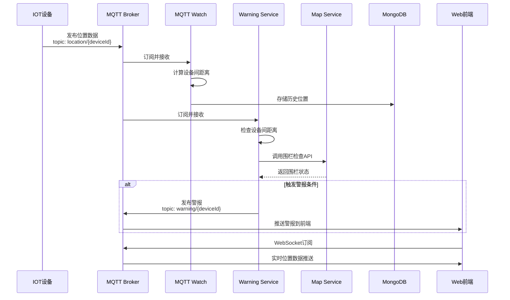
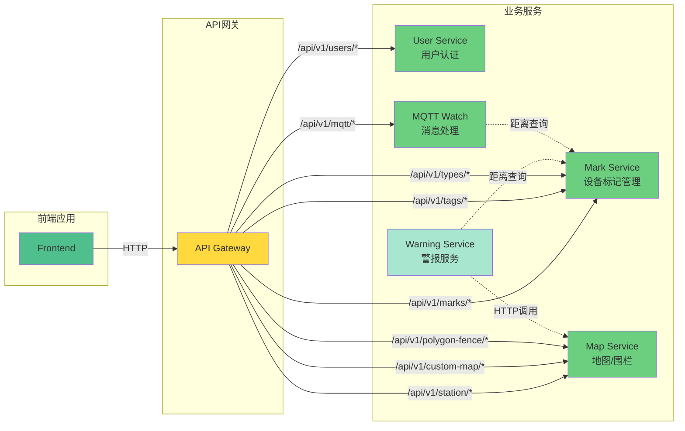
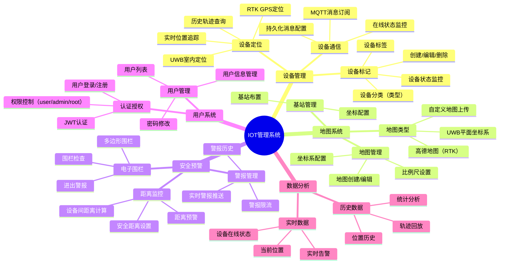
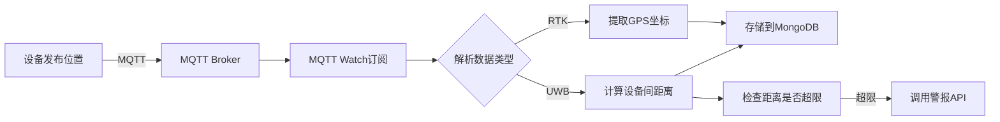
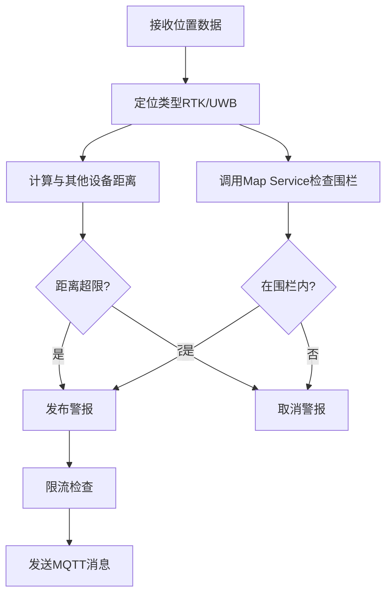

# 🌐 IOT 管理系统 (IOT-Manage-System)

<div align="center">


**一个基于微服务架构的智能物联网设备管理平台**

[快速开始](#快速开始) • [系统架构](#系统架构) • [功能特性](#功能特性) • [API 文档](#api文档)

</div>

---

## 📋 目录

- [项目概述](#项目概述)
- [系统架构](#系统架构)
- [功能特性](#功能特性)
- [技术栈](#技术栈)
- [快速开始](#快速开始)
- [服务详解](#服务详解)
- [环境配置](#环境配置)
- [API 文档](#api文档)
- [开发指南](#开发指南)
- [部署说明](#部署说明)

---

## 🎯 项目概述

IOT 管理系统是一个功能完善的物联网设备管理平台，支持**UWB 室内定位**、**RTK 高精度定位**、**电子围栏**、**实时警报**等功能。系统采用微服务架构，具有高可用性、可扩展性和易维护性。

### 核心能力

- 🗺️ **多地图支持**：支持高德地图、自定义地图、UWB 平面坐标系统
- 📍 **多定位技术**：UWB 室内定位、RTK 高精度 GPS 定位
- 🚨 **智能预警**：电子围栏、设备距离监控、实时警报推送
- 📊 **实时监控**：设备在线状态、历史轨迹、位置数据可视化
- 👥 **用户管理**：多用户权限控制、JWT 认证
- 📡 **MQTT 通信**：低延迟、高可靠的消息传输

---

## 🏗️ 系统架构

### 整体架构图



### 数据流图



### 微服务交互图



---

## ✨ 功能特性

### 功能模块思维导图



### 核心功能列表

#### 1. 🗺️ 地图与定位

- **多地图支持**

  - 高德地图：支持 RTK GPS 定位可视化
  - 自定义地图：上传平面图（支持 PNG/JPG/GIF/WEBP）
  - UWB 坐标系：纯平面坐标系统，无需底图

- **基站管理**

  - 基站位置配置与管理
  - 可视化基站分布

- **实时定位显示**
  - 设备位置实时刷新
  - 多设备同时显示
  - 轨迹绘制

#### 2. 📱 设备管理

- **设备标记管理**

  - 设备信息：ID、名称、类型、标签
  - 设备分类：通过类型和标签分组
  - 在线状态：最后在线时间追踪

- **MQTT 配置**
  - 自定义订阅主题
  - 持久化消息配置
  - 设备通信监控

#### 3. 🚨 安全预警

- **电子围栏**

  - 多边形围栏创建（基于 PostGIS）
  - 实时围栏检查
  - 进入/离开自动警报

- **距离监控**

  - 设备间实时距离计算（基于 UWB）
  - 安全距离配置（全局/类型/设备对）
  - 距离超限警报

- **智能限流**
  - 防止警报风暴
  - 状态缓存机制

#### 4. 👥 用户与权限

- **多级权限**

  - Root：超级管理员
  - Admin：管理员
  - User：普通用户

- **JWT 认证**
  - Token 过期自动刷新
  - 7 天登录有效期

#### 5. 📊 数据存储

- **PostgreSQL**

  - 用户信息
  - 设备标记
  - 地图配置
  - 围栏数据（PostGIS）

- **MongoDB**
  - 设备位置历史
  - 时序数据存储

---

## 🛠️ 技术栈

### 后端技术

| 技术          | 版本  | 用途                               |
| ------------- | ----- | ---------------------------------- |
| **Go**        | 1.21+ | 主要开发语言                       |
| **Gin**       | -     | HTTP 框架（Gateway, User Service） |
| **Fiber**     | v2    | 高性能 HTTP 框架（其他服务）       |
| **GORM**      | -     | ORM 框架                           |
| **JWT**       | -     | 用户认证                           |
| **Paho MQTT** | v1.4  | MQTT 客户端                        |

### 前端技术

| 技术             | 版本   | 用途        |
| ---------------- | ------ | ----------- |
| **Vue**          | 3.5.18 | 前端框架    |
| **TypeScript**   | 5.8    | 类型安全    |
| **Vue Router**   | 4.5+   | 路由管理    |
| **Pinia**        | 3.0+   | 状态管理    |
| **Axios**        | 1.11+  | HTTP 客户端 |
| **MQTT.js**      | 5.14+  | MQTT 客户端 |
| **高德地图**     | -      | 地图显示    |
| **Tailwind CSS** | 4.1+   | 样式框架    |
| **Radix Vue**    | -      | UI 组件库   |

### 中间件

| 组件           | 版本             | 用途             |
| -------------- | ---------------- | ---------------- |
| **PostgreSQL** | 17 (PostGIS 3.5) | 主数据库         |
| **MongoDB**    | latest           | 时序数据存储     |
| **Mosquitto**  | 2.x              | MQTT 消息代理    |
| **Nginx**      | -                | 前端静态文件服务 |

### 开发工具

- **Docker** & **Docker Compose**：容器化部署
- **Git**：版本控制
- **ESLint** & **Prettier**：代码规范

---

## 🚀 快速开始

### 前置要求

- **Docker** >= 20.10
- **Docker Compose** >= 2.0
- **Git**

### 一键启动

1. **克隆项目**

```bash
git clone https://github.com/your-username/IOT-Manage-System.git
cd IOT-Manage-System
```

2. **配置环境变量**

创建 `.env` 文件（用于前端构建）：

```bash
# 高德地图配置（可选）
VITE_AMAP_KEY=your-amap-key
VITE_AMAP_SECURITY_CODE=your-security-code

# MQTT WebSocket地址
VITE_MQTT_URL=ws://localhost:8083
```

3. **启动所有服务**

```bash
docker-compose up -d
```

4. **访问系统**

- **前端界面**：http://localhost (或 http://localhost:3000)
- **API 网关**：http://localhost:8000
- **默认账户**：
  - 用户名：`admin`
  - 密码：`admin`

### 服务端口

| 服务                | 端口     | 说明              |
| ------------------- | -------- | ----------------- |
| Frontend            | 80, 3000 | Web 界面          |
| API Gateway         | 8000     | 统一网关          |
| User Service        | 8001     | 用户服务（内部）  |
| Map Service         | 8002     | 地图服务          |
| MQTT Watch          | 8003     | MQTT 监控（内部） |
| Mark Service        | 8004     | 标记服务（内部）  |
| PostgreSQL          | 5433     | 数据库            |
| MongoDB             | 27018    | NoSQL 数据库      |
| Mosquitto MQTT      | 1883     | MQTT TCP          |
| Mosquitto WebSocket | 8083     | MQTT WebSocket    |

---

## 📦 服务详解

### 1️⃣ API Gateway（API 网关）

**路径**: `api-gateway/`  
**端口**: `8000`  
**技术栈**: Go + Gin

#### 功能

- 统一入口，路由转发
- JWT 认证中间件
- CORS 跨域处理
- 用户信息解析与透传

#### 路由规则

```go
/api/v1/users/*          → User Service (8001)
/api/v1/marks/*          → Mark Service (8004)
/api/v1/tags/*           → Mark Service (8004)
/api/v1/types/*          → Mark Service (8004)
/api/v1/mqtt/*           → MQTT Watch (8003)
/api/v1/station/*        → Map Service (8002)
/api/v1/custom-map/*     → Map Service (8002)
/api/v1/polygon-fence/*  → Map Service (8002)
/uploads/*               → Map Service (8002)
```

---

### 2️⃣ User Service（用户服务）

**路径**: `user-service/`  
**端口**: `8001`  
**技术栈**: Go + Gin + GORM

#### 功能

- 用户注册/登录
- JWT Token 签发
- 用户信息管理
- 权限控制（user/admin/root）

#### 数据库表

- `users`: 用户信息

#### 主要 API

```
POST   /api/v1/users/register       # 用户注册
POST   /api/v1/users/login          # 用户登录
GET    /api/v1/users/profile        # 获取当前用户信息
PUT    /api/v1/users/profile        # 更新用户信息
GET    /api/v1/users                # 获取用户列表（管理员）
DELETE /api/v1/users/:id            # 删除用户（管理员）
```

---

### 3️⃣ Mark Service（标记服务）

**路径**: `mark-service/`  
**端口**: `8004`  
**技术栈**: Go + Fiber + GORM

#### 功能

- 设备标记管理（CRUD）
- 标签（Tag）管理
- 类型（Type）管理
- 设备对距离配置
- 设备在线状态更新

#### 数据库表

- `marks`: 设备标记
- `mark_tags`: 标签
- `mark_types`: 类型
- `mark_tag_relation`: 标记-标签关系
- `mark_pair_safe_distance`: 设备对安全距离

#### 主要 API

**标记管理**

```
POST   /api/v1/marks                           # 创建标记
GET    /api/v1/marks                           # 获取标记列表（分页）
GET    /api/v1/marks/:id                       # 获取单个标记
PUT    /api/v1/marks/:id                       # 更新标记
DELETE /api/v1/marks/:id                       # 删除标记
GET    /api/v1/marks/device/:device_id         # 根据设备ID获取
```

**标签管理**

```
POST   /api/v1/tags                            # 创建标签
GET    /api/v1/tags                            # 获取标签列表
GET    /api/v1/tags/:tag_id                    # 获取标签详情
PUT    /api/v1/tags/:tag_id                    # 更新标签
DELETE /api/v1/tags/:tag_id                    # 删除标签
```

**类型管理**

```
POST   /api/v1/types                           # 创建类型
GET    /api/v1/types                           # 获取类型列表
GET    /api/v1/types/:type_id                  # 获取类型详情
PUT    /api/v1/types/:type_id                  # 更新类型
DELETE /api/v1/types/:type_id                  # 删除类型
```

**距离配置**

```
POST   /api/v1/pairs/distance                  # 设置设备对距离
POST   /api/v1/pairs/combinations              # 批量设置距离
POST   /api/v1/pairs/cartesian                 # 笛卡尔积设置
GET    /api/v1/pairs/distance/:m1/:m2          # 查询距离
DELETE /api/v1/pairs/distance/:m1/:m2          # 删除距离配置
```

---

### 4️⃣ Map Service（地图服务）

**路径**: `map-service/`  
**端口**: `8002`  
**技术栈**: Go + Fiber + GORM + PostGIS

#### 功能

- 基站管理
- 自定义地图管理（上传、配置）
- 多边形围栏（创建、检查）
- 空间查询（PostGIS）
- 静态文件服务

#### 数据库表

- `base_stations`: 基站
- `custom_maps`: 自定义地图
- `polygon_fences`: 多边形围栏（含空间字段）

#### 主要 API

**基站管理**

```
POST   /api/v1/station                         # 创建基站
GET    /api/v1/station                         # 获取基站列表
GET    /api/v1/station/:id                     # 获取基站详情
PUT    /api/v1/station/:id                     # 更新基站
DELETE /api/v1/station/:id                     # 删除基站
```

**地图管理**

```
POST   /api/v1/custom-map                      # 创建地图
GET    /api/v1/custom-map                      # 获取地图列表
GET    /api/v1/custom-map/latest               # 获取最新地图
GET    /api/v1/custom-map/:id                  # 获取地图详情
PUT    /api/v1/custom-map/:id                  # 更新地图
DELETE /api/v1/custom-map/:id                  # 删除地图
```

**围栏管理**

```
POST   /api/v1/polygon-fence                   # 创建围栏
GET    /api/v1/polygon-fence                   # 获取围栏列表
GET    /api/v1/polygon-fence/:id               # 获取围栏详情
PUT    /api/v1/polygon-fence/:id               # 更新围栏
DELETE /api/v1/polygon-fence/:id               # 删除围栏
POST   /api/v1/polygon-fence/:id/check         # 检查点是否在围栏内
POST   /api/v1/polygon-fence/check-all         # 检查点在哪些围栏内
```

**静态文件**

```
GET    /uploads/maps/:filename                 # 访问上传的地图图片
```

📖 **详细文档**: [API_DOCUMENTATION.md](map-service/API_DOCUMENTATION.md)

---

### 5️⃣ MQTT Watch（MQTT 监控服务）

**路径**: `mqtt-watch/`  
**端口**: `8003`  
**技术栈**: Go + Fiber + Paho MQTT + MongoDB

#### 功能

- 订阅设备 MQTT 消息
- 解析定位数据（UWB/RTK）
- 计算设备间距离
- 存储历史位置到 MongoDB
- 触发警报控制接口

#### MQTT 主题

**订阅**:

- `location/#`: 设备位置数据
- `online/#`: 设备在线状态

**发布**:

- `warning/{deviceId}`: 警报控制（payload: 0/1）

#### 数据流程



#### 主要 API

```
POST   /api/v1/mqtt/warning/:deviceId/start    # 开启设备警报
POST   /api/v1/mqtt/warning/:deviceId/end      # 关闭设备警报
```

---

### 6️⃣ Warning Service（警报服务）

**路径**: `warning-service/`  
**技术栈**: Go + Paho MQTT + PostgreSQL

#### 功能

- 监听设备位置数据
- **距离监控**：实时计算设备间距离，超出安全距离则警报
- **围栏检查**：调用 Map Service API 检查是否进入围栏
- **警报发布**：通过 MQTT 发布警报消息
- **智能限流**：防止警报风暴（每秒最多 2 次）
- **状态缓存**：避免重复警报

#### MQTT 主题

**订阅**:

- `location/#`: 设备位置数据
- `online/#`: 设备上线状态

**发布**:

- `warning/{deviceId}`: 警报消息（payload: 1=警报，0=取消）

#### 工作流程



#### 距离监控优先级

1. **设备对距离**：针对特定两个设备的自定义距离
2. **类型默认距离**：同类型设备的默认安全距离
3. **跳过检查**：如果设置为-1 则不检查

#### 围栏检查

- 异步检查，不阻塞主流程
- HTTP 超时：3 秒
- 自动降级（Map Service 不可用时跳过）
- 状态缓存避免重复警报

📖 **详细文档**: [FENCE_FEATURE.md](warning-service/FENCE_FEATURE.md)

---

### 7️⃣ Frontend（前端应用）

**路径**: `frontend/`  
**端口**: `80`, `3000`  
**技术栈**: Vue3 + TypeScript + Vite

#### 主要页面

| 路由                  | 页面     | 功能                |
| --------------------- | -------- | ------------------- |
| `/`                   | 首页     | 系统概览            |
| `/login`              | 登录     | 用户登录            |
| `/map/rtk`            | RTK 地图 | 高德地图+RTK 定位   |
| `/map/uwb`            | UWB 地图 | 自定义地图+UWB 定位 |
| `/map/settings`       | 地图设置 | 自定义地图管理      |
| `/map/settings/fence` | 围栏设置 | 电子围栏管理        |
| `/stations`           | 基站管理 | 基站配置            |
| `/marks/status`       | 设备状态 | 设备在线监控        |
| `/marks/manage`       | 设备管理 | 设备信息管理        |
| `/marks/list`         | 设备列表 | 设备列表查看        |
| `/profile`            | 个人信息 | 用户资料            |

#### 核心功能

**1. 实时地图显示**

- 高德地图集成（RTK 模式）
- Canvas 自定义地图绘制（UWB 模式）
- 实时设备位置更新

**2. MQTT 实时通信**

```typescript
// 订阅设备位置
mqtt.subscribe("location/#");

// 订阅警报
mqtt.subscribe("warning/#");

// 订阅在线状态
mqtt.subscribe("online/#");
```

**3. 围栏可视化**

- 围栏绘制与编辑
- 设备进出高亮显示
- 实时警报提示

**4. 数据可视化**

- 设备状态统计
- 历史轨迹回放
- ECharts 图表展示

---

## ⚙️ 环境配置

### Docker Compose 配置

所有服务的环境变量都在 `docker-compose.yml` 中配置。

#### PostgreSQL

```yaml
POSTGRES_DB: iot_manager_db
POSTGRES_USER: postgres
POSTGRES_PASSWORD: password
TZ: Asia/Shanghai
```

#### MongoDB

```yaml
MONGO_INITDB_ROOT_USERNAME: admin
MONGO_INITDB_ROOT_PASSWORD: admin
```

#### Mosquitto MQTT

- 配置文件：`config/mosquitto.conf`
- 密码文件：`config/mosquitto.passwd`
- 默认用户：`admin` / `admin`

#### 微服务通用配置

```yaml
# 数据库连接
DB_HOST: postgres
DB_PORT: 5432
DB_NAME: iot_manager_db
DB_USER: postgres
DB_PASSWORD: password

# JWT密钥
JWT_SECRET: your-secret-key

# 时区
TZ: Asia/Shanghai
```

#### 特殊配置

**Map Service**

```yaml
DB_MAX_OPEN_CONNS: 100
DB_MAX_IDLE_CONNS: 20
DB_MAX_LIFETIME: 1h
```

**MQTT Watch**

```yaml
MQTT_BROKER: ws://mosquitto:8083
MQTT_USERNAME: admin
MQTT_PASSWORD: admin
MONGO_HOST: mongo
MONGO_PORT: 27017
```

**Warning Service**

```yaml
MAP_SERVICE_HOST: map-service
MAP_SERVICE_PORT: 8002
```

**Frontend**

```yaml
VITE_AMAP_KEY: ${VITE_AMAP_KEY}
VITE_AMAP_SECURITY_CODE: ${VITE_AMAP_SECURITY_CODE}
VITE_MQTT_URL: ${VITE_MQTT_URL}
```

---

## 📚 API 文档

### 统一响应格式

**成功响应**:

```json
{
  "code": 200,
  "message": "success",
  "data": { ... }
}
```

**错误响应**:

```json
{
	"code": 400,
	"message": "参数错误",
	"details": "具体错误信息"
}
```

### 详细文档

- **Map Service**: [map-service/API_DOCUMENTATION.md](map-service/API_DOCUMENTATION.md)
- **Warning Service**: [warning-service/FENCE_FEATURE.md](warning-service/FENCE_FEATURE.md)

### 常用 API 示例

#### 1. 用户登录

```bash
curl -X POST http://localhost:8000/api/v1/users/login \
  -H "Content-Type: application/json" \
  -d '{
    "username": "admin",
    "password": "admin"
  }'
```

#### 2. 创建设备标记

```bash
curl -X POST http://localhost:8000/api/v1/marks \
  -H "Content-Type: application/json" \
  -H "Authorization: Bearer YOUR_TOKEN" \
  -d '{
    "device_id": "device-001",
    "mark_name": "移动设备1",
    "mark_type_id": 1
  }'
```

#### 3. 创建电子围栏

```bash
curl -X POST http://localhost:8000/api/v1/polygon-fence \
  -H "Content-Type: application/json" \
  -H "Authorization: Bearer YOUR_TOKEN" \
  -d '{
    "fence_name": "安全区域",
    "points": [
      {"x": 0, "y": 0},
      {"x": 100, "y": 0},
      {"x": 100, "y": 50},
      {"x": 0, "y": 50}
    ],
    "description": "核心安全区域"
  }'
```

#### 4. 发布设备位置（MQTT）

```bash
# 使用mosquitto_pub工具
mosquitto_pub -h localhost -p 1883 \
  -u admin -P admin \
  -t "location/device-001" \
  -m '{
    "id": "device-001",
    "sens": [
      {
        "n": "UWB",
        "u": "cm",
        "v": [5000, 2500]
      }
    ]
  }'
```

---

## 💻 开发指南

### 本地开发

#### 后端开发

1. **安装 Go** (>= 1.21)

2. **启动依赖服务**

```bash
# 只启动数据库和MQTT
docker-compose up -d postgres mongo mosquitto
```

3. **启动某个微服务**

```bash
cd user-service
export DB_HOST=localhost
export DB_PORT=5433  # Docker映射到5433
export DB_NAME=iot_manager_db
export DB_USER=postgres
export DB_PASSWORD=password
export JWT_SECRET=your-secret-key
go run main.go
```

#### 前端开发

1. **安装 Node.js** (>= 20.19.0)

2. **安装依赖**

```bash
cd frontend
npm install
```

3. **启动开发服务器**

```bash
npm run dev
```

4. **访问**: http://localhost:5173

### 代码规范

#### Go 代码规范

- 使用 `gofmt` 格式化代码
- 遵循 [Effective Go](https://go.dev/doc/effective_go) 指南
- 错误处理不可忽略
- 使用有意义的变量名

#### TypeScript/Vue 代码规范

```bash
# 代码检查
npm run lint

# 代码格式化
npm run format

# 类型检查
npm run type-check
```

### 项目结构

#### Go 服务通用结构

```
service-name/
├── main.go           # 入口文件
├── handler/          # HTTP处理器
├── service/          # 业务逻辑
├── repo/            # 数据访问层
├── model/           # 数据模型
├── utils/           # 工具函数
├── middleware/      # 中间件（如有）
├── Dockerfile       # 容器化
├── go.mod           # 依赖管理
└── go.sum
```

#### 前端结构

```
frontend/
├── src/
│   ├── api/          # API接口
│   ├── components/   # 组件
│   ├── views/        # 页面
│   ├── router/       # 路由
│   ├── stores/       # 状态管理
│   ├── utils/        # 工具函数
│   ├── types/        # 类型定义
│   └── styles/       # 样式
├── public/           # 静态资源
└── index.html        # 入口HTML
```

---

## 🐳 部署说明

### Docker 部署（推荐）

#### 1. 生产环境部署

```bash
# 拉取最新镜像
docker-compose pull

# 启动所有服务
docker-compose up -d

# 查看日志
docker-compose logs -f

# 查看服务状态
docker-compose ps
```

#### 2. 单独构建镜像

```bash
# 构建单个服务
docker-compose build user-service

# 构建所有服务
docker-compose build
```

#### 3. 使用预构建镜像

所有服务的镜像已发布到 GitHub Container Registry：

```
ghcr.io/xiaozhuabcd1234/iot-manage-system_api-gateway:latest
ghcr.io/xiaozhuabcd1234/iot-manage-system_user-service:latest
ghcr.io/xiaozhuabcd1234/iot-manage-system_map-service:latest
ghcr.io/xiaozhuabcd1234/iot-manage-system_mqtt-watch:latest
ghcr.io/xiaozhuabcd1234/iot-manage-system_mark-service:latest
ghcr.io/xiaozhuabcd1234/iot-manage-system_frontend:latest
ghcr.io/xiaozhuabcd1234/iot-warning-service:latest
```

### 健康检查

所有服务都提供健康检查端点：

```bash
# User Service
curl http://localhost:8000/api/v1/users/health

# Map Service
curl http://localhost:8002/health

# Mark Service
curl http://localhost:8000/api/v1/marks/health
```

### 数据备份

#### PostgreSQL 备份

```bash
# 导出数据
docker exec iot_postgres pg_dump -U postgres iot_manager_db > backup.sql

# 恢复数据
docker exec -i iot_postgres psql -U postgres iot_manager_db < backup.sql
```

#### MongoDB 备份

```bash
# 导出数据
docker exec iot_mongo mongodump --username admin --password admin --out /backup

# 恢复数据
docker exec iot_mongo mongorestore --username admin --password admin /backup
```

### 日志管理

```bash
# 查看所有服务日志
docker-compose logs

# 查看特定服务日志
docker-compose logs -f api-gateway

# 查看最近100行日志
docker-compose logs --tail=100

# 实时跟踪日志
docker-compose logs -f --tail=50
```

### 性能优化

#### 数据库连接池

在 `docker-compose.yml` 中调整：

```yaml
environment:
  DB_MAX_OPEN_CONNS: 100
  DB_MAX_IDLE_CONNS: 20
  DB_MAX_LIFETIME: 1h
```

#### 资源限制

为容器设置资源限制：

```yaml
services:
  user-service:
    deploy:
      resources:
        limits:
          cpus: "1"
          memory: 512M
        reservations:
          cpus: "0.5"
          memory: 256M
```

---

## 🔧 故障排查

### 常见问题

#### 1. 服务无法启动

**检查步骤**:

```bash
# 查看服务状态
docker-compose ps

# 查看服务日志
docker-compose logs service-name

# 检查端口占用
netstat -ano | findstr :8000
```

#### 2. 数据库连接失败

**解决方案**:

- 确认 PostgreSQL 健康检查通过
- 检查数据库连接配置
- 查看数据库日志

```bash
docker-compose logs postgres
```

#### 3. MQTT 连接失败

**检查**:

- Mosquitto 是否正常运行
- 用户名密码是否正确
- 防火墙/端口是否开放

```bash
# 测试MQTT连接
mosquitto_pub -h localhost -p 1883 -u admin -P admin -t "test" -m "hello"
```

#### 4. 前端无法访问 API

**检查**:

- API Gateway 是否启动
- CORS 配置是否正确
- JWT Token 是否有效

#### 5. 围栏检查不工作

**排查**:

- 检查 PostGIS 扩展是否安装
- 确认 Map Service 可访问
- 查看 Warning Service 日志

```bash
docker exec iot_postgres psql -U postgres -d iot_manager_db -c "SELECT PostGIS_Version();"
```

---

## 📊 系统监控

### 关键指标

#### 服务健康

```bash
# 检查所有服务
docker-compose ps

# 检查服务健康状态
docker inspect --format='{{.State.Health.Status}}' iot_user-service
```

#### 资源使用

```bash
# 查看容器资源使用
docker stats

# 查看磁盘使用
docker system df
```

#### 数据库状态

```bash
# PostgreSQL连接数
docker exec iot_postgres psql -U postgres -c "SELECT count(*) FROM pg_stat_activity;"

# MongoDB状态
docker exec iot_mongo mongosh --username admin --password admin --eval "db.serverStatus()"
```

---

## 🔒 安全建议

### 生产环境配置

1. **修改默认密码**

   - PostgreSQL: `POSTGRES_PASSWORD`
   - MongoDB: `MONGO_INITDB_ROOT_PASSWORD`
   - MQTT: `config/mosquitto.passwd`
   - 管理员账户密码

2. **使用强 JWT 密钥**

   ```bash
   JWT_SECRET=$(openssl rand -hex 32)
   ```

3. **启用 HTTPS**

   - 使用 Nginx 反向代理
   - 配置 SSL 证书
   - 强制 HTTPS 重定向

4. **网络隔离**

   - 内部服务不暴露端口
   - 使用 Docker 网络隔离

5. **日志审计**
   - 启用操作日志
   - 定期备份日志
   - 监控异常访问

---

## 🤝 贡献指南

欢迎贡献代码！请遵循以下步骤：

1. Fork 本仓库
2. 创建特性分支 (`git checkout -b feature/AmazingFeature`)
3. 提交更改 (`git commit -m 'Add some AmazingFeature'`)
4. 推送到分支 (`git push origin feature/AmazingFeature`)
5. 开启 Pull Request

### 提交规范

使用语义化提交信息：

- `feat`: 新功能
- `fix`: 修复 Bug
- `docs`: 文档更新
- `style`: 代码格式
- `refactor`: 重构
- `test`: 测试
- `chore`: 构建/工具

---

## 📄 许可证

本项目采用 MIT 许可证，详见 [LICENSE](LICENSE) 文件。

---

## 📞 联系方式

- **项目地址**: https://github.com/your-username/IOT-Manage-System
- **Issue**: https://github.com/your-username/IOT-Manage-System/issues

---

## 🌟 致谢

感谢以下开源项目：

- [Go](https://golang.org/)
- [Vue.js](https://vuejs.org/)
- [Gin](https://gin-gonic.com/)
- [Fiber](https://gofiber.io/)
- [PostgreSQL](https://www.postgresql.org/)
- [MongoDB](https://www.mongodb.com/)
- [Eclipse Mosquitto](https://mosquitto.org/)
- [PostGIS](https://postgis.net/)

---

<div align="center">

**⭐ 如果这个项目对你有帮助，请给个星标支持！**

Made with ❤️ by 107lab

</div>
